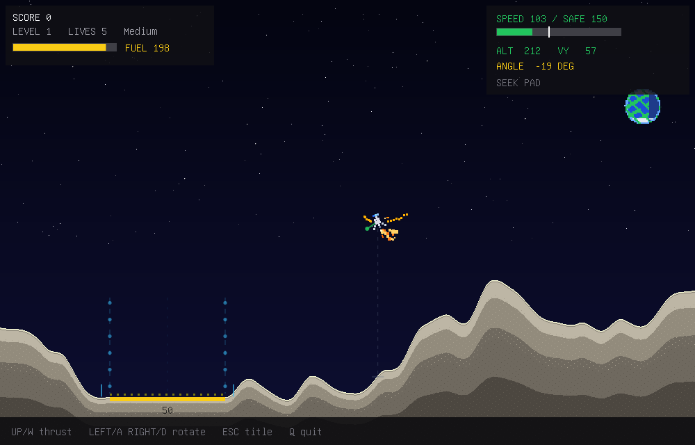

# Terminal Lander

Kitty-protocol Lunar Lander in C: a software-rendered RGBA framebuffer,
zlib/base64 kitty graphics, raw keyboard input, procedural sound, and a
fixed-timestep game loop.

It follows the Bashed Earth terminal-rendering style while turning the Python
`terminal_lander.py` prototype into a native retro arcade game with lunar
terrain, flat scoring pads, fuel, lives, level progression, altitude warnings,
landing tolerances, and crash particles.

Built for Linux and kitty-protocol terminals such as kitty, ghostty, and
wezterm.



## Features

- **Four difficulty presets** - Easy, Medium, Hard, and Extra Hard, with
  Extra Hard preserving the original prototype tuning
- **Assistive flight model** - lower presets add more fuel, wider pads,
  softer limits, stronger damping, and control stabilization
- **Retro software renderer** - pixel-art lander, stars, Earth backdrop,
  layered lunar terrain, HUD panels, pad guides, particles, and screen shake
- **Procedural sound** - synthesized thrust, warning, landing, crash, and
  menu effects streamed to the first available CLI audio sink
- **Terminal-native presentation** - no SDL, no X11, no ncurses; frames are
  compressed and streamed through the kitty graphics protocol
- **Headless checks** - deterministic selftest and render-test modes for CI

## Build

Linux only. Needs gcc or clang, zlib, libm, pthreads, and a terminal that
supports the kitty graphics protocol:

```sh
make
./terminal-lander
```

Sound plays through the first available CLI sink (`pacat`, `pw-play`,
`aplay`, or sox's `play`). If no sink is found, the game runs silently.

## Controls

| Key | Action |
|-----|--------|
| Up / W | main thrust |
| Left / A | rotate left + side thrust |
| Right / D | rotate right + side thrust |
| Enter / Space | start, advance, restart |
| Esc | return to title during flight |
| Left / Right on title | change difficulty |
| 1-4 on title | Easy / Medium / Hard / Extra Hard |
| C | controls screen |
| Q | quit |

Difficulty presets change fuel, lives, pad width, terrain roughness, landing
tolerance, damping, and control assistance.

## Development

```sh
make test                              # deterministic headless checks
./terminal-lander --selftest 42 3600   # specific seed and tick count
./terminal-lander --render-test 7      # dump render_*.ppm screenshots
./terminal-lander --sound-test
```

## Architecture

| File | Role |
|------|------|
| `src/term.c` | raw mode, key decoding, kitty graphics frames, threaded zlib + base64 presenter |
| `src/game.c` | lander physics, terrain generation, pads, particles, difficulty, scoring |
| `src/render.c` | software rasterizer, scene, HUD, menus, embedded PSF font |
| `src/sound.c` | procedural SFX synth and mixer piped to a CLI audio sink |
| `src/main.c` | interactive loop, selftest, render-test, sound-test |

## License

MIT - see [LICENSE](LICENSE). The embedded terminal font comes from Debian
console-setup's public-domain console fonts; details are preserved in
`src/font8x16.h`.
